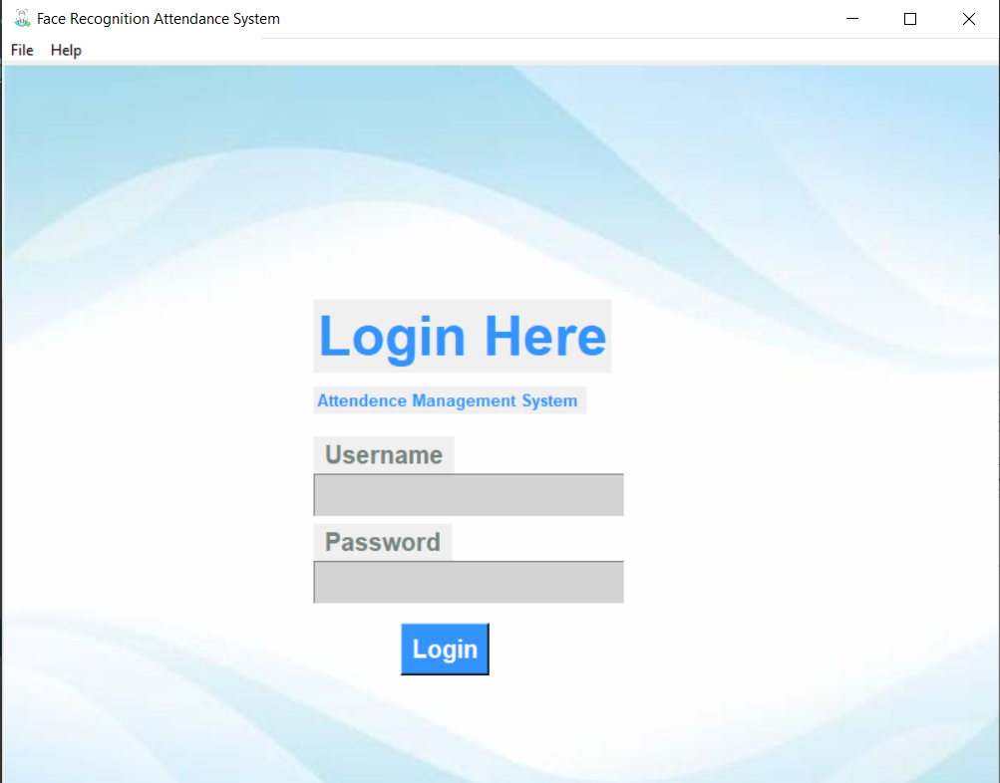
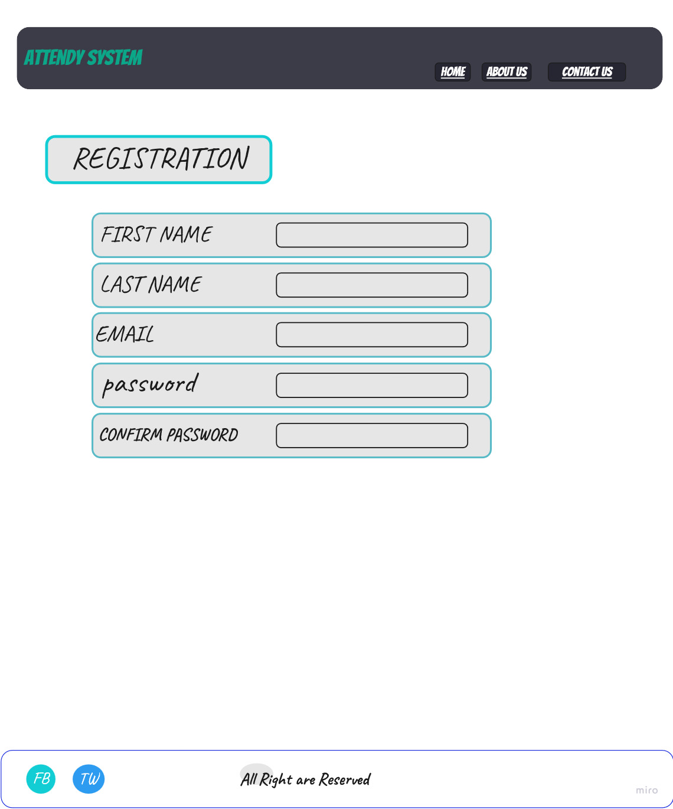
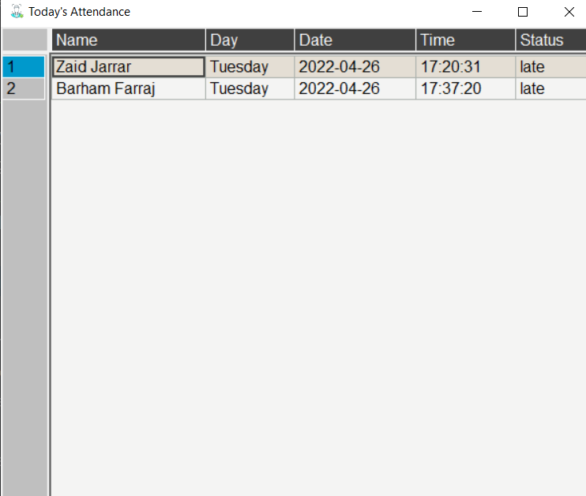
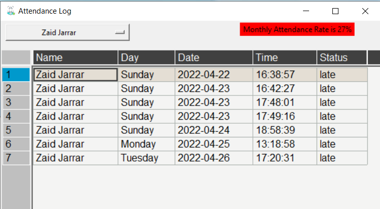
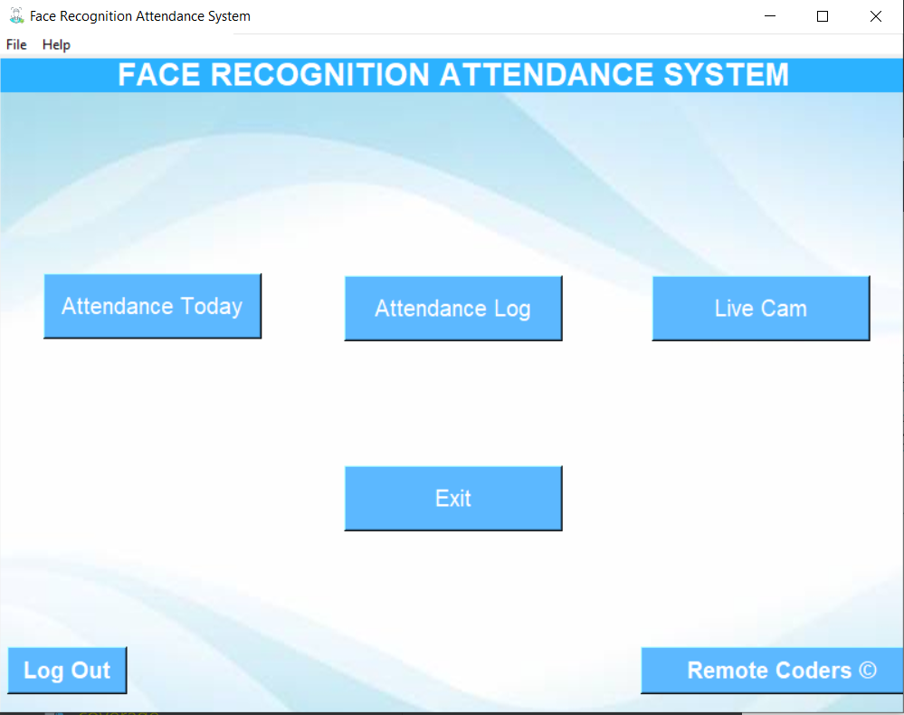

# FaceRecognition-Attendance-System

## Team Members

-Ahmad Jaara 

-Barham Farraj

-Eman Al-shaikh

-Faisal Al Hawajreh

-Raneem Oqaily

-Zaid Jarrar

--- 
the main objective of this software is to provide software solution for Human Resource(HR) managers for managing employee’s attendance details based on face recognition to actually recognize emplyees faces and differentiate between them. 
this system will reduce the effort and the time to record the attendence , so it will increase the productivity for the HR . 

the main user for this system is the HR managers , the first page that will appear for thim is the Login page, the HR will provide the following information to the system as shown in the following image .
 

if the user does not has a profile , he will Sign Up to create a new account so this regestration page will appear to him when pressing on Sign Up ( this is a stretch goal )

when the user enters to the system , this page will be appeared to the user , it contains :
- logout : to exit the system .
- attendence today : it will navigate to another page that show the user a report for employees attendence  that presents the details for each employee : the name , day ,date , time , and if they late or not . 

- employees : this will navigate to the employees profile 

- live cam : this will show the user  the live stream for webcam (this is stretch goal )

